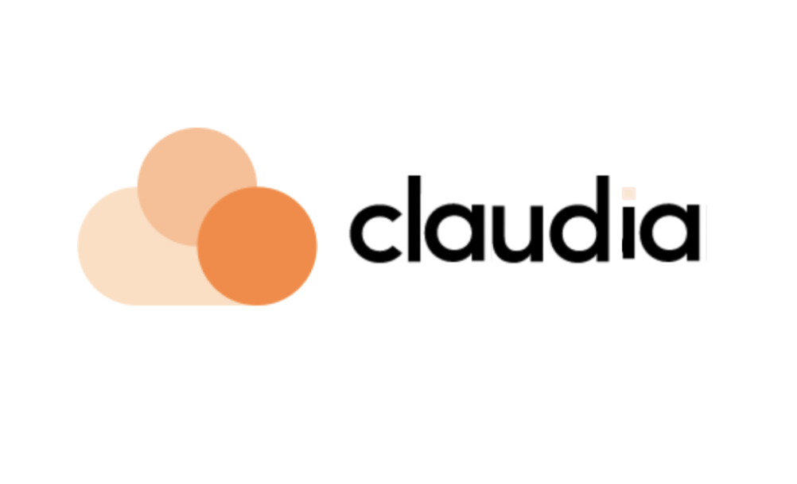

<div align="center"></div>

# ClaudIA
Codebase of the new Cloud Humans chat bot

## 📄 Requirements
- Python 3.8+
- Streamlit 
  - To install just run `pip install streamlit`

## 🛠️ Setup
Follow these steps in order to run this application locally

### 🔑 Configuring secrets
Create a file `.streamlit/secrets.toml` with the content:
```
API_KEY="<API_KEY_HERE>"
COMPANY_NAME="<COMPANY_NAME_HERE>"
HANDOVER_CONFIDENCE_LIMIT="<HANDOVER_CONFIDENCE_LIMIT>"
HANDOVER_MESSAGES_LIMIT="<HANDOVER_MESSAGES_LIMIT>"
DEBUG="<DEBUG>"
```

Example:
```
API_KEY="sk-xxx"
COMPANY_NAME="Cloud Humans"
HANDOVER_CONFIDENCE_LIMIT="20"
HANDOVER_MESSAGES_LIMIT="1"
DEBUG="true"
```


### 🧪 Installing the dependencies
Just run
```bash
pip install -r requirements.txt
```

### ▶️ Running the application
Just run
```bash
streamlit run app.py
```
